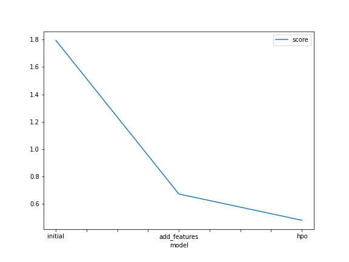
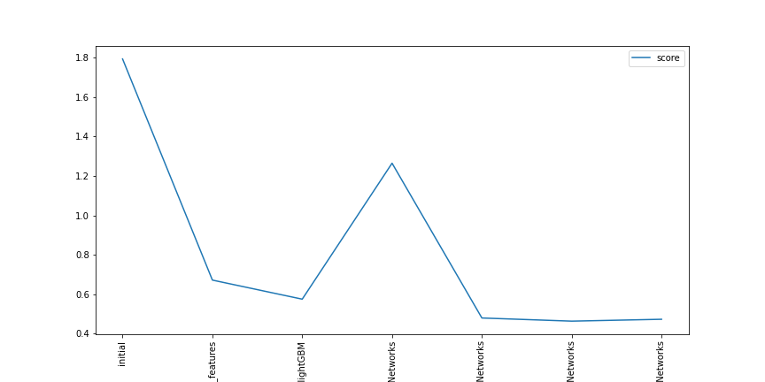

# Report: Predict Bike Sharing Demand with AutoGluon Solution
#### Sahil Shaikh

## Initial Training
### What did you realize when you tried to submit your predictions? What changes were needed to the output of the predictor to submit your results?
The first time when I used the raw dataset without perfoming any data analysis or feature engineering the model did not perfomed as well as expected bescause it had a lot of error, In order to be able to submit my results to kaggle I needed to replace the negative numbers with 0

### What was the top ranked model that performed?
The top rank model was the third model hypo3-lightGBM & NeuralNetworks which was trained with featurized data, and also by tuning on lighGBM & NeuralNetworks model algorithms. The kaggle RMSE score of the top rank model was 0.46291.

## Exploratory data analysis and feature creation
### What did the exploratory analysis find and how did you add additional features?
For the extra features I divided the datetime in month, day, year and hour. Also it was usefull to transform the season and weather features to categorical

### How much better did your model preform after adding additional features and why do you think that is?
Because additional features can be good predictors to estimate the target value, in this case I decided to separate the date becuase it helps the model to analyse seasonality paterns in the data which can be usefull for a regression model

## Hyper parameter tuning
### How much better did your model preform after trying different hyper parameters?
The model performed much better than the initial model but a little bit worse than the improvement with just the features. I followed the suggested hyperparameter improvement for tabular data provided by autogluon but did not manage to figure out how to additionally tune the parameters in order to improve the result. More background information is needed to fine-tune the model.

### If you were given more time with this dataset, where do you think you would spend more time?
I would try to figure out more ways to improve on the features as they seem to be the ones that lead to improvement of the score. Maybe some one-hot encoding or adjusting for the seasons or working hours will provide us with a better result.

### Create a table with the models you ran, the hyperparameters modified, and the kaggle score.
|model|score| "initial"|1.79435 "add_features"|0.67136 "hpo"|0.47931
### Create a line plot showing the top model score for the three (or more) training runs during the project.

TODO: Replace the image below with your own.

### Create a line plot showing the top kaggle score for the three (or more) prediction submissions during the project.

TODO: Replace the image below with your own.

## Summary
The most benefit is received by working with the features and you can gain great insights from the EDA. Working forward my goal would be to improve the model by taking into consideration the working hours which impact the bike demand and the seasonal spikes and lows.
